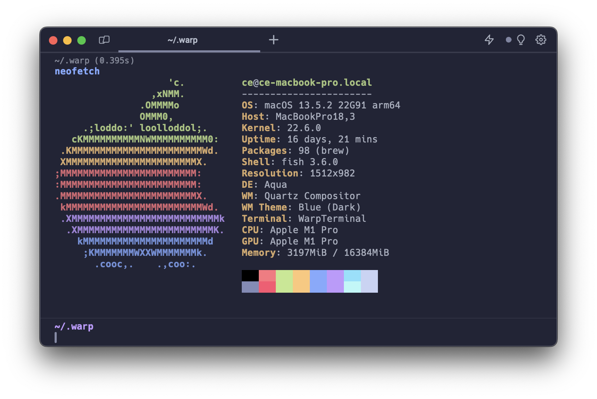

# Warp Moonlight Theme
A custom theme for Warp based on [Moonlight II theme for VsCode](https://github.com/atomiks/moonlight-vscode-theme)

## Install

- Create a config directory `~/.warp/themes` in your home directory.
- Download the .yaml theme [file](https://raw.githubusercontent.com/christian-ek/warp-moonlight/main/Moonlight.yaml) from GitHub and copy it to `~/.warp/themes`.
- Change the theme in `Settings > Appearance` (`⌘+,`).

Reference: [https://docs.warp.dev/features/themes](https://docs.warp.dev/features/themes#1.-how-do-i-use-a-custom-theme-in-warp)